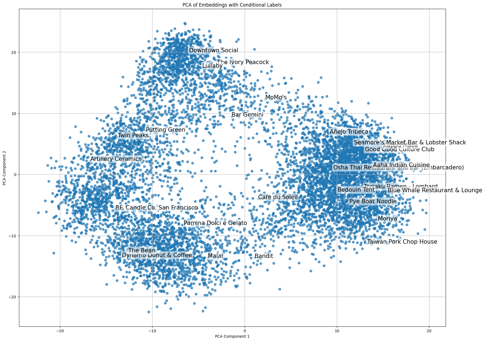
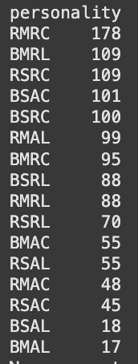
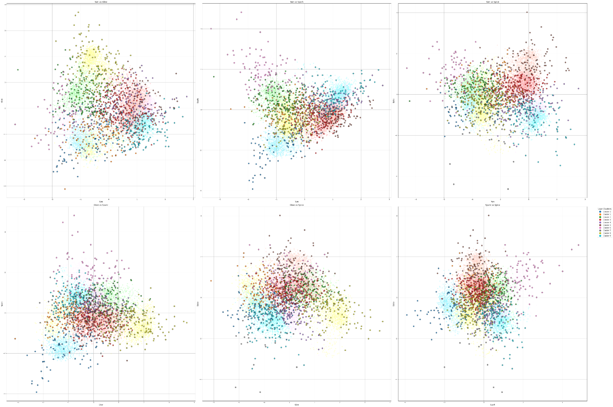
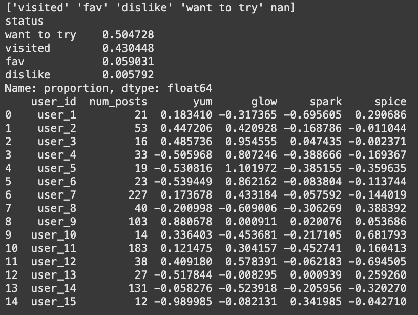
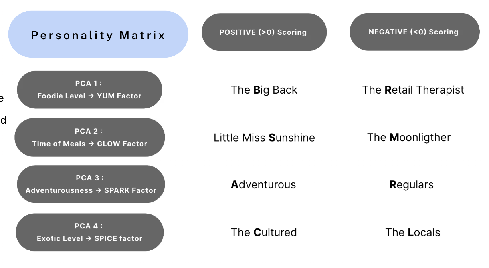
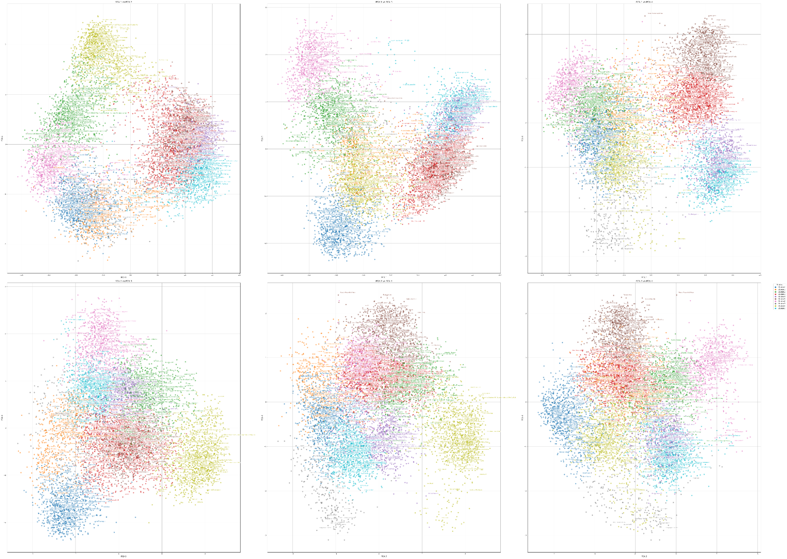
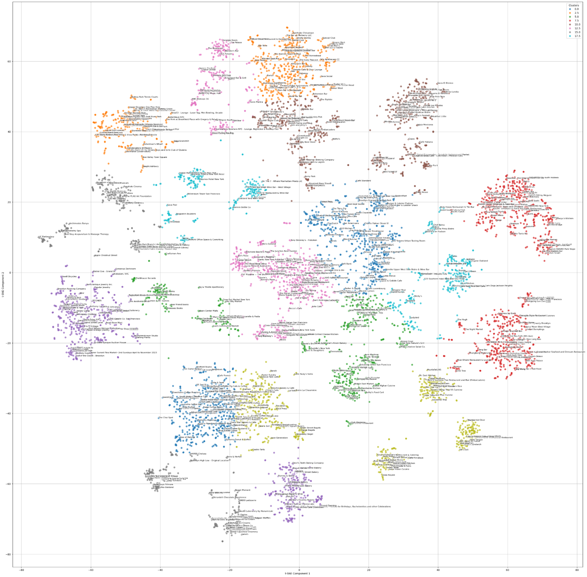

# cornerstones

This project had a unique problem to tackle: **how do we find patterns in our user base using only data about the places they’ve visited?**  
We believed from the beginning that utilizing the embeddings in some way was our best bet. If the good people at Corner have done their due diligence, a strong majority of the information that could be gleaned from the other columns in the dataset is already wrapped up in the vectors. However, thirteen dimensions felt quite unwieldy. We needed to crunch down the data space into something more manageable. All figures used in this report are from the final version of the notebook, so feel free to check them out in greater resolution there.

  
  

**Fig 1 – t-SNE and PCA dimensionality reduction into two dimensions**

We first tried both t-SNE and PCA on the vectors, collapsing the data space into two dimensions. We wanted to get a lay of the land and see what kind of relationships may be present in our data, and a 2-D space is easily visualized.  
However, we felt that two elements per restaurant wasn’t enough to capture the nuances of a location that Corner clearly cares about, so we upped the number of dimensions to four. Not visualizable in all its glory, but easily broken down into understandable 2-D graphs (you will see why this is important soon).

We ran our PCA to break down the location data into four dimensions and normalized the scores (also important later), which is visualized below as six different relationship graphs between the four axes.

  

**Fig 2 – 2-D relationship graphs between the “vibes” in 4-D space**

We called these axes “vibes” for the cute marketable name, so if I use the word *vibe* in this report that is what I’m referring to. Taking a look at these graphs and some of the restaurants on the extremes of these axes we began to look for possible interpretations of these vibes. We eventually landed on four factors:

| Principal Component | “Vibe” Name | Quick Meaning |
|---------------------|-------------|---------------|
| PC-1                | **Yum**     | Food vs. non-food locations |
| PC-2                | **Glow**    | Daytime cafés ↔ nightlife spots |
| PC-3                | **Spark**   | Surprise / novelty factor |
| PC-4                | **Spice**   | Familiar Western fare ↔ adventurous cuisines |

Once we’d fully digested what each location means, we then sought to calculate how the places a person has visited informs us about their personal vibes.

  

**Fig 3 – Raw calculated vibe scores (per user)**

We opted for a weighted sum, with *favorites* and *dislikes* pulling the scores heavily while *visited* and *want-to-try* gently pulled up the sum. We then normalized the scores so that they’d sit on the same scale as the locations they were derived from. This lets us cluster users and locations in the same way later down the line. We also used these vibe scores to create a shareable personality type, similar to the MBTI test.

  
  

**Fig 4 – Frequencies of personality types in the dataset**

The most common personality type on Corner, according to our models, is someone who lives to hang out and shop, goes out at night, is probably a regular at a café, but likes to try food from many different cultures.

  

**Fig 5 – User vibe scores overlaying location vibe scores**

The final piece of analysis—and probably the most actionable—is shown above. Because we scaled our vibe scores, we can place **users and locations in the same 4-D space**. A *BSAL* (someone who loves eating, enjoys the sun, and is a bit tired of getting “the usual”) would love to find new cafés to explore. The Corner app could go even further, connecting people with similar personality types so they can take over a booth at a local dive bar together or split an omakase adventure.

We’re very proud of the vibe system we created, and hope you see the value it can bring in categorizing users and bringing them together!
